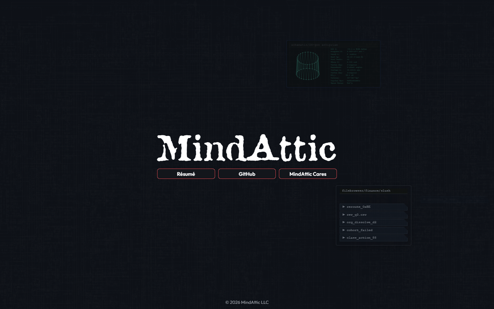

# mindattic.com

Ryan DeBraal's front door: one hand-authored HTML page with the MindAttic wordmark, three links and a tap-to-play Cyberspace backdrop, with no build step, no framework and no tracking.

[](index.htm) [](index.htm) [](index.htm) [](https://github.com/mindattic/MindAttic.UiUx) [](https://mindattic.com)



Try it: [mindattic.com](https://mindattic.com)

## Why

- One click from the MindAttic name to the résumé, the GitHub organisation or the charity, with nothing in the way.
- The page is the same shape on every screen. Every length is a multiple of one viewport unit, so a phone and an ultrawide monitor see the same composition.
- View Source is meant to be read. The file opens with an ASCII banner and a numbered table of contents, so it reads like a conversation, not a puzzle.
- Nothing to install and nothing to build. The file you edit is the file the browser runs.
- No analytics, no tracking pixels and no third-party fonts. The only outside host is a tag-pinned CDN copy of MindAttic's own asset package.

## Features

| Piece | What it is |
|---|---|
| `#site-name` | The "MindAttic" wordmark, set in the Attic display font |
| `.link-row` and `.link-btn` | Three equal-width buttons: Résumé (`https://ryandebraal.com`), GitHub (`https://github.com/mindattic`) and MindAttic Cares (`https://mindatticcares.com`). Each opens in a new window, which screen readers announce through `aria-describedby` |
| `.lockup` | The wordmark and buttons, centred both ways. The three buttons together are exactly as wide as the wordmark |
| `#site-footer` | Copyright line fixed to the bottom edge. The page never scrolls |
| No selection | Text can't be highlighted (`user-select: none`), long-press shows no iOS copy bubble and taps don't flash a highlight box. Links and keyboard focus still work |
| Cyberspace block | The backdrop (circuit-board parallax, scanlines, console windows), spliced in by the UiUx sync |
| Tap script | Tap or left-click anywhere off the buttons to spawn one random Cyberspace effect. Right and middle clicks are ignored |

Everything on the page is a multiple of one viewport-relative unit (`--u`, 1% of the smaller visible viewport side), so it keeps the same shape on every screen and aspect ratio.


The file opens with an ASCII banner and a numbered table of contents, from § 1 to § 12, aimed at anyone who opens View Source (see [BIBLE §2](docs/BIBLE.md#MAC-§2) and [LAW-7](docs/BIBLE.md#MAC-LAW-7)).

The page was radically simplified on 2026-10-02. Read [MAC-A6](docs/AMENDMENTS.md#MAC-A6) for what changed and why.

## Quick start

You need Python 3 (or any static file server) and a network connection, because fonts, logo, effects engine and textures load from jsDelivr.

```powershell
git clone https://github.com/mindattic/mindattic.com
cd mindattic.com
python -m http.server 3457
start http://localhost:3457/index.htm
```

You should see the wordmark and three buttons over the dark Cyberspace backdrop. Tap the background to spawn an effect. The `/run` Claude Code skill does the same thing.

The page no longer fetches any local data, so serving over HTTP is not strictly required (it used to be, to avoid a CORS-blocked `fetch()` of `data/*.json`). Opening `index.htm` directly works too.

## Stack

`HTML5`, `CSS3` (custom properties, `dvmin`-based sizing, dark "Cyberspace" palette only: the theme toggle was retired, see [MAC-A1](docs/AMENDMENTS.md#MAC-A1)), one small vanilla JavaScript snippet, and the shared Cyberspace bundle from `MindAttic.UiUx`.

No React. No Vite. No npm. No analytics, tracking pixels or third-party fonts. The only external host is `cdn.jsdelivr.net`, serving the `MindAttic.UiUx` repo ([LAW-6](docs/BIBLE.md#MAC-LAW-6), refined by [MAC-A6](docs/AMENDMENTS.md#MAC-A6)).

## Where the assets live

The assets are not in this repo and not in the HTML. Fonts (Outfit, Attic), the logo PNGs, the Cyberspace effects engine and its parallax textures are plain static files in the sibling MindAttic.UiUx repo, served over jsDelivr at a tag-pinned URL:

```text
https://cdn.jsdelivr.net/gh/mindattic/MindAttic.UiUx@V9/<path>
```

`<head>` opens the connection early (`preconnect`) and preloads the first-paint fonts. The two big engine scripts are `defer`red so they never block the first paint.

UiUx tags are immutable whole numbers (`V7`, `V8`, `V9`, and so on). The page currently pins `V9`. To take a newer asset release, change every `MindAttic.UiUx@V…` in `index.htm`. The Cyberspace block's tag is set by the sync script's `-CyberspaceCdnTag`, which defaults to the latest `V*` tag in the UiUx checkout. Never point the page at `@main`.

Layout of the package (full rules in `MindAttic.UiUx/docs/ASSETS.md`):

- Shared fonts at the repo root: `fonts/outfit/`, `fonts/attic/`.
- Site-specific files directly under the domain folder as `<domain>/<category>/` (this site: `mindattic.com/logos/`).
- Cyberspace textures at `Components/Cyberspace/assets/`.
- Filenames are lowercase kebab-case.

## Project layout

```text
mindattic.com/
├── index.htm                  # The entire homepage: wordmark, three buttons, backdrop
├── idiotproof/                # Support pages for the IdiotProof sub-project (see below), still deployed
│   ├── privacy-policy.htm     # Standalone privacy policy, deployed to /idiotproof/
│   ├── terms-of-use.htm       # Standalone terms of use, deployed to /idiotproof/
│   ├── dataset/               # ML feature-store exports (trades.csv, bars.csv, manifest.json)
│   └── replays/               # Generated trade-replay HTML archive: gitignored, deploy-only
├── docs/                      # Codex canon: BIBLE, AMENDMENTS, USER_STORIES, rfc/, images/
├── tools/
│   ├── codex.ps1              # doctor (validate docs/) and digest (regenerate BIBLE.digest.md)
│   └── build-readme.ps1       # Thin wrapper -> shared engine in ../codex-standard/build-readme.ps1
├── .claude/                   # Slash commands (/deploy, /fetch, /quicksave, /quickload), skills
│                              #   (/run, /commit, /discard, /revert), hooks (digest injection,
│                              #   quickload-on-do)
│
│   DORMANT: kept on disk, no longer used by the page (MAC-A6)
├── data/                      # software/ecosystem/hardware/books/visual-arts .json (generated)
├── fetch-descriptions.ps1     # Regenerates data/*.json from GitHub repo metadata + Amazon synopses
├── add-book.ps1 / .bat        # Appends an Amazon book (cover as base64) to data/books.json
├── diagram/                   # ecosystem.mmd (Mermaid) -> render.ps1 -> ecosystem.svg
├── previews/                  # <RepoName>.b64 preview images used by fetch-descriptions.ps1
├── .image-base64.txt          # Base64 source text for an old inlined image
└── README.md                  # This file
```

`deploy.ps1`, `deploy.bat` and a per-repo FTP `settings.json` are retired. Deployment lives in the sibling MindAttic.Deploy repo (see [Deployment](#deployment)).

## Editing the page

The only region you must not hand-edit is the `BEGIN/END MINDATTIC.UIUX:CYBERSPACE` block: the next UiUx sync overwrites it ([LAW-2](docs/BIBLE.md#MAC-LAW-2)).

### Change a link or the wordmark

Edit the three `<a class="link-btn">` anchors (or the `<h1 id="site-name">`) near the end of `index.htm`. Keep `target="_blank" rel="noopener noreferrer"` on the links. The layout adapts on its own: the buttons are equal width and span exactly the wordmark's width.

### Take a new asset release

1. Add or change the file in `MindAttic.UiUx`, tag the next whole-number release and push the tag.
2. Change every `MindAttic.UiUx@V…` in `index.htm` to the new tag (or run the UiUx sync with `-CyberspaceCdnTag V<n>` for the Cyberspace block, and update the font and logo URLs by hand).
3. Confirm the new URLs resolve (`curl -I` them) before deploying.

The linked deploy does all three steps for you (see [Deployment](#deployment)).

### Cyberspace, the only synced component

It is not run on its own from this repo. It happens as step 3 of a deploy, through `MindAttic.UiUx/sync/sync-mindattic-com.ps1`, which rewrites only the `CYBERSPACE` marker block. This site is no longer enrolled for the `OutfitFont`, `AtticFont`, `PinFooter` or `WebSnapshot` components: the fonts load straight from the CDN.

### Dormant generators

These still run, but their output (`data/*.json`, the ecosystem SVG) is not shown anywhere any more:

```powershell
powershell -NoProfile -ExecutionPolicy Bypass -File "D:\Projects\MindAttic\mindattic.com\fetch-descriptions.ps1"
powershell -File add-book.ps1 https://www.amazon.com/dp/B0XXXXXXXX
powershell -File diagram\render.ps1      # WILL THROW: the ECOSYSTEM-DIAGRAM markers are no longer in index.htm
```

- `fetch-descriptions.ps1` rebuilds `data/software.json`, `ecosystem.json` and `hardware.json` from every public `mindattic` GitHub repo. Visibility is the only gate; the `hardware` topic and the `MindAttic.*` prefix only pick the section ([MAC-A4](docs/AMENDMENTS.md#MAC-A4)). It also refreshes `data/books.json` synopses from Amazon, and has `-ListUntagged` and `-ProposeDescriptions` / `-ApplyDescriptions` (README-derived description write-back through `gh repo edit`, human-approved first). It requires the `gh` CLI and does nothing if `gh` is missing. It never writes `index.htm`.
- `add-book.ps1` appends an Amazon book (cropped cover as a base64 data URL, deduplicated by ASIN) to `data/books.json`.
- Whether to delete this machinery is an open decision ([MAC-US-D5](docs/USER_STORIES.md#MAC-US-D5)).

## The idiotproof folder

[IdiotProof](https://github.com/mindattic/IdiotProof) is one of the `MindAttic.*` ecosystem software projects: a tool that connects to a brokerage account (Alpaca) to author and evaluate trading strategies and, optionally, place orders. Its project page is its GitHub README. The old catalog landing page (`mindattic.com/idiotproof.htm`) was retired (MindAttic.Deploy DEP-A6).

What does live in this repo, under `idiotproof/`, is the small set of static support pages that ship to `/idiotproof/` on the same domain:

| Path | What it is | Tracked in git |
|---|---|---|
| `idiotproof/privacy-policy.htm` | Standalone privacy policy page | Yes |
| `idiotproof/terms-of-use.htm` | Standalone terms-of-use page | Yes |
| `idiotproof/dataset/manifest.json`, `trades.csv`, `bars.csv` | Exported ML feature-store data (one row per round-trip trade, one row per minute bar), generated by IdiotProof's own SQL export and checked in | Yes |
| `idiotproof/replays/**` | A generated archive of trade-strategy replays (an `index.htm` per ticker plus one per replay run), grouped by trading day | No: gitignored, it exists only to be uploaded |

These are plain static files with their own inline `<style>` and `<script>`. They are uploaded by the `idiotproof-replays` site entry in `MindAttic.Deploy/projects.json` (`uploadDir`), separately from `index.htm`.

## Deployment

Use the `/deploy` Claude Code slash command, or run:

```powershell
cd D:\Projects\MindAttic\MindAttic.Deploy
npm run deploy -- --site mindattic.com
```

The pipeline is owned entirely by the sibling MindAttic.Deploy repo. This repo's own `deploy.ps1`, `deploy.bat` and FTP `settings.json` are retired ([MAC-A2](docs/AMENDMENTS.md#MAC-A2)).

It is a linked 4-in-1 deploy: deploying this site also publishes `MindAttic.UiUx` and deploys `ryandebraal.com` and `mindatticcares.com` (see `MindAttic.Deploy/README.md`, "Linked deploy"):

1. Preflight: `MindAttic.UiUx` must be clean, on `main`, not behind origin, with a current manifest.
2. Publishes the next `MindAttic.UiUx` tag (`V<n>`) if its `HEAD` is ahead of the latest tag.
3. Pins that tag in each site's `index.htm` and runs `sync-mindattic-com.ps1` to splice the Cyberspace block.
4. Verifies every asset the sites use is live on jsDelivr, byte-exact, before anything is uploaded.
5. Stamps the `Last Updated` comment at the top of `index.htm` and FTPS-uploads it to `/mindattic.com/`.

Only `index.htm` is uploaded. The fonts, logo, engine and textures are already on the CDN (they ship when the `MindAttic.UiUx` tag is pushed), and `data/*.json` is no longer needed on the server ([MAC-A6](docs/AMENDMENTS.md#MAC-A6) supersedes [MAC-A3](docs/AMENDMENTS.md#MAC-A3)).

This site's deploy profile lives in `MindAttic.Deploy/projects.json` under `sites[]`. The old per-project landing pages (`mindattic.com/<slug>.htm`, for example `idiotproof.htm`) and the catalog mode that built them were retired (MindAttic.Deploy DEP-A6): each repo's GitHub README is now its project page. FTP credentials are centralised in MindAttic.Deploy (gitignored there); this repo no longer reads its own `settings.json` for that.

A `PostToolUse` hook in `.claude/settings.json` also stamps the `Last Updated` comment locally on every `Edit` or `Write` of `index.htm`, independent of a deploy.

## Conventions

- Asset URLs: `https://cdn.jsdelivr.net/gh/mindattic/MindAttic.UiUx@V<n>/<path>`, tag-pinned, whole-number tags, never `@main`.
- Asset layout in `MindAttic.UiUx`: shared fonts at the root (`fonts/<family>/`), per-site files at `<domain>/<category>/` (no `assets/` level), kebab-case filenames, variant last (`m-monogram-transparent.png`).
- Page CSS: IDs for singletons (`#content`, `#site-name`, `#site-footer`); classes for reusable pieces (`.lockup`, `.link-row`, `.link-btn`); sizing chain `--u` to `--wm` to `--btn-u`; lengths in `rem` or `dvmin`, or multiples of those variables.

The full list is [BIBLE §10](docs/BIBLE.md#MAC-§10).

## Testing

There is no compiler, unit-test suite or CI in this repo: it is a static HTML page with dormant PowerShell generators. "Verified" here means the file loads as HTML, the page's markup is present as documented, and `codex doctor` passes clean. The shared Playwright suite in `MindAttic.UiUx/tests` covers the linked sites.

```powershell
powershell -NoProfile -ExecutionPolicy Bypass -File tools\codex.ps1 doctor   # validate docs/
powershell -NoProfile -ExecutionPolicy Bypass -File tools\codex.ps1 digest   # regenerate the digest
powershell -NoProfile -ExecutionPolicy Bypass -File tools\build-readme.ps1   # regenerate README.htm
```

## Documentation

This repo follows the MindAttic Codex documentation standard (project code MAC). A fact lives in exactly one layer:

| Layer | File | What it holds |
|---|---|---|
| L0 | [docs/BIBLE.md](docs/BIBLE.md) | What the site is and is not, architecture, the Laws (`MAC-LAW-n`), verified state, glossary, conventions |
| L1 | [docs/AMENDMENTS.md](docs/AMENDMENTS.md) | Append-only change log (`MAC-A<n>`); an amendment wins over the bible |
| L2 | [docs/USER_STORIES.md](docs/USER_STORIES.md) | Stories `MAC-US-<Epic><n>`; every done story cites its evidence |
| rfc | [docs/rfc](docs/rfc/) | Design notes (for example `0001-codex-adoption.md`) that graduate into the layers above |
| generated | [docs/BIBLE.digest.md](docs/BIBLE.digest.md) | Produced by `tools/codex.ps1 digest`; never hand-edited |

Agent instructions: [AGENTS.md](AGENTS.md) is this project's agent entrypoint. `CLAUDE.md` is a provider forwarder to the workspace-wide MindAttic agent standard.

## License

This repo has no LICENSE file. All rights reserved.

---

Part of [MindAttic](https://mindattic.com) — see more projects at [github.com/mindattic](https://github.com/mindattic). Related: [ryandebraal.com](https://github.com/mindattic/ryandebraal.com), [mindatticcares.com](https://github.com/mindattic/mindatticcares.com), [MindAttic.UiUx](https://github.com/mindattic/MindAttic.UiUx), [MindAttic.Deploy](https://github.com/mindattic/MindAttic.Deploy).
